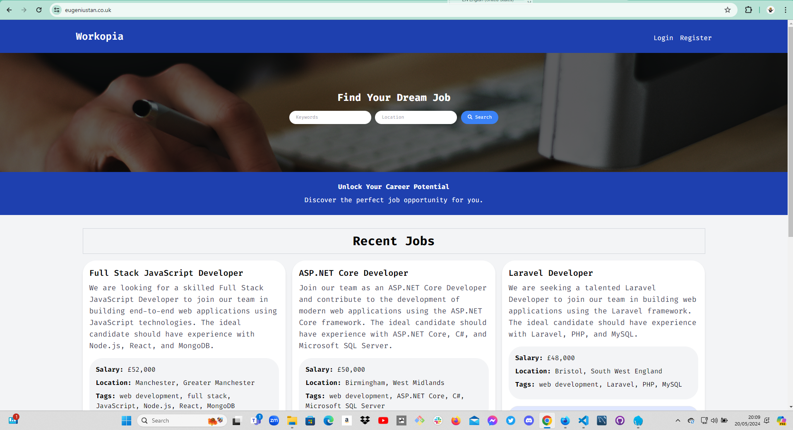
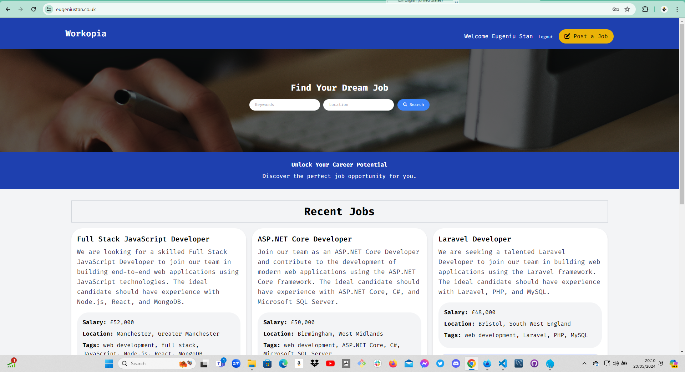
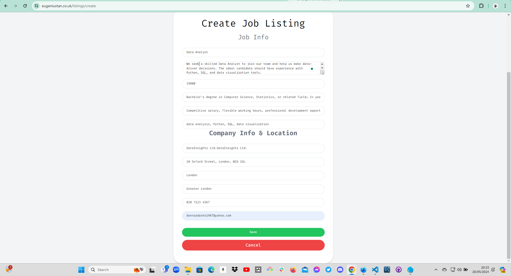
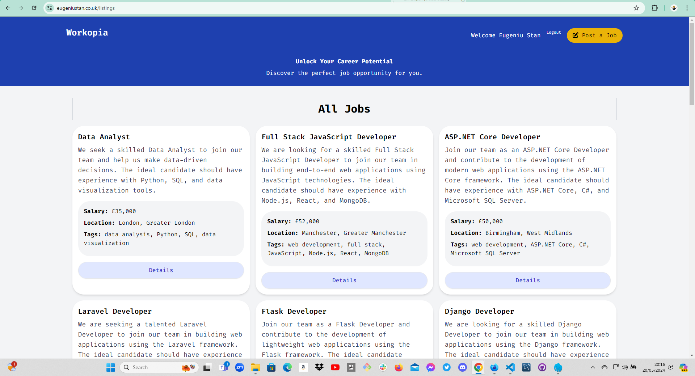

# Job Listing Application

[](https://www.php.net/)
[](https://opensource.org/licenses/MIT)

A web application for job listings built with PHP, allowing users to browse, search, create, edit, and delete job listings. The application provides a user-friendly interface for job seekers to find relevant job opportunities and for employers to post job vacancies.







## Features

- User authentication and authorization
- Browse and search job listings
- Create new job listings (for authenticated users)
- View job listing details
- Edit and delete job listings (for listing owners)
- Responsive and intuitive user interface

## Requirements

- PHP >= 7.4
- Composer (for dependency management)
- MySQL or compatible database

## Installation

1. Clone the repository:

   ```bash
   git clone https://github.com/your-username/job-listing-app.git
   ```

2. Navigate to the project directory:

   ```bash
   cd job-listing-app
   ```

3. Install the dependencies using Composer:

   ```bash
   composer install
   ```

4. Create a new MySQL database for the application.

5. Rename the `.env.example` file to `.env` and update the database configuration settings:

   ```bash
   DB_HOST=localhost
   DB_PORT=3306
   DB_DATABASE=your_database_name
   DB_USERNAME=your_username
   DB_PASSWORD=your_password
   ```

6. Import the database schema:

   ```bash
   mysql -u your_username -p your_database_name < database/schema.sql
   ```

7. Start the PHP built-in web server:

   ```bash
   php -S localhost:8000 -t public
   ```

8. Access the application in your web browser at `http://localhost:8000`.

## Usage

- Register a new account or log in with an existing account.
- Browse the job listings on the homepage.
- Use the search functionality to find specific job listings based on keywords and location.
- Click on a job listing to view its details.
- Create a new job listing by clicking on the "Post a Job" button (if authenticated).
- Edit or delete your own job listings from the listing details page.

## File Structure

- `public/`: Contains the entry point (`index.php`) and publicly accessible assets.
- `src/`: Contains the application source code.
  - `App/`: Contains the application-specific code.
    - `Controllers/`: Contains the controller classes for handling requests.
    - `views/`: Contains the view templates for rendering the user interface.
  - `Framework/`: Contains the framework-related code.
    - `Database.php`: Handles database connections and queries.
    - `Router.php`: Handles routing and request dispatching.
    - ...
  - `config/`: Contains configuration files.
    - `db.php`: Database configuration settings.
  - `helpers.php`: Contains helper functions used throughout the application.
- `vendor/`: Contains the Composer dependencies (generated after running `composer install`).
- `.env.example`: Example environment configuration file.
- `composer.json`: Composer configuration file for managing dependencies.
- `README.md`: Application documentation.

## Contributing

Contributions are welcome! If you find any issues or have suggestions for improvements, please open an issue or submit a pull request.

## License

This project is licensed under the [MIT License](https://opensource.org/licenses/MIT).

---

Feel free to customize the README file based on your specific application and add any additional sections or information that you think would be helpful for users and contributors.